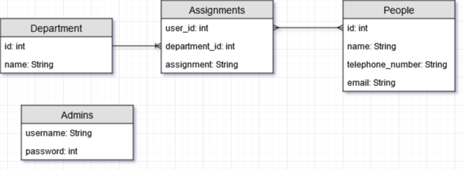

# Backend megvalósítása
## Fejlesztői környezet és annak beállításai
- Fejlesztéshez szükséges programok:
	- Java 1.8
	- Netbeans (vagy bármilyen más java kódot fordítani és futtatni képes eszköz) 
	- Postgres (vagy más endpoint tesztre képes eszköz)
- Program futtatásához szükséges külön beállítások:
	- Nincs ilyen
## Adatbázis terv:

- Ahol az Enum értékei: TELEPHONE, MOBILE_PHONE, EMAIL
## Könyvtárstruktúra
A programban 6 külön alkönyvtár található, amik a következőek:
- **Entities**: Ez a mappa tárolja az adatbázisbeli táblák Java beli ábrázolását.
- **Repositories**: Az adott entiti-kből való adatlekéréseket tároló osztályok találhatóak meg ebben a mappában.
- **Controllers**: A különböző entitik megnézéséhez/felvételéhez/szerkesztéséhez/törléséhez szükséges endpointokat tartalmazó mappa.
- **Security**: Az adatbázis endpoint védelmét szolgáló osztályait tároló mappa.
- **Keys**: A Contact osztály összetett kulcsát representáló segédosztályt tároló mappa.
- **Error**: Speciális errorüzeneteket osztályát tároló mappa.
## Végpontok
###### Person végpontjai
- `GET /person` A person entity-k kilistázása
- `GET /person/findByName` A person entity név szerinti listázása
- `POST /person/new` Új person felvétele
- `PUT /person/:id` A person entity id szerinti módosítása
- `DELETE /person/:id` A person entity id szerinti törlése
###### Department végpontjai
- a
###### Contact végpontjai
- a
###### Admin végpontjai
- a
[Vissza az főleírásra](../README.md)